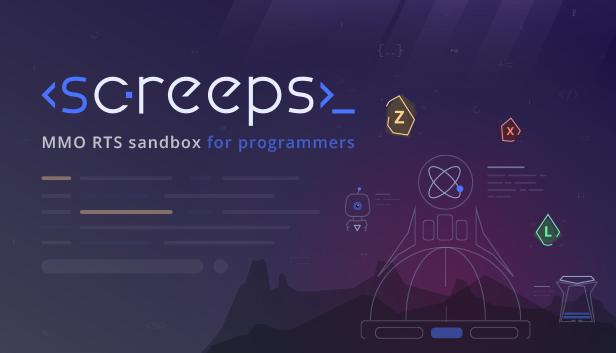
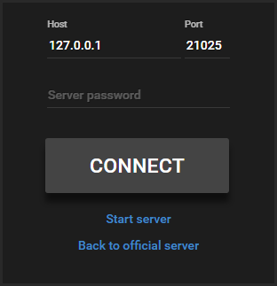
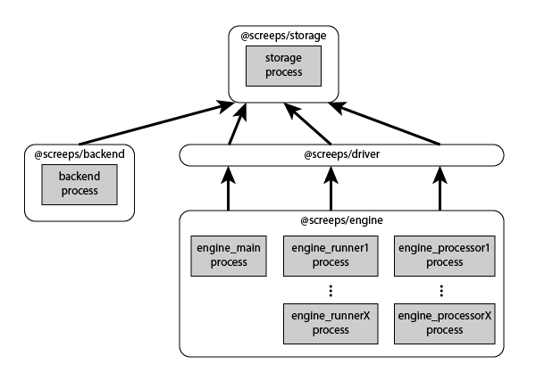

[](https://screeps.com)

[Screeps](https://screeps.com) is a MMO RTS sandbox game for programmers, wherein the core mechanic is programming your units AI. You control your colony by writing JavaScript which operate 24/7 in the single persistent world filled by other players on par with you.

This project is a distributed, standalone game server that allows you to launch your own game world on a local computer or dedicated server on the Internet.

Server launch
-------------

The server consists of multiple parallel processes linked to each other. There is a separate launcher process to launch them correctly, and these launchers have various versions for different purposes.

**GUI launcher.** This is the easiest way to launch the server. It comes with the standard package of the [Steam version](http://store.steampowered.com/app/464350) of the game. You launch the game via the server's executable file that shows the GUI with logs of all started processes and the CLI interface to control the server.

**Console launcher.** You can also launch the server without the GUI using the command line:

```
npm install -g screeps
screeps init
screeps start
```

Prerequisites:
 * Node.js 6 or higher
 * Python 2 (for node-gyp, [Python 3 is not supported](https://github.com/nodejs/node-gyp/issues/193)) 

You will be prompted for your Steam Web API key, you can obtain it on [this page](https://steamcommunity.com/dev/apikey).

**Your own launcher.** The launchers are intended to launch other server's processes and give them correct environment variables. You can launch those processes your own way (for example, via upstart/systemd, for distributing them across different machines, or setting up an automated testing framework). Please refer to the file [`launcher/lib/start.js`](https://github.com/screeps/launcher/tree/master/lib/start.js) for the list of environment variables that each process needs.

Connect to server
-----------------

You can connect to your private server using the Steam game client. Click "Change server" and enter your server credentials:



Launch options
--------------

If you use a stock launcher (either desktop or console), the file `.screepsrc` in the current catalog stores launch configuration options. You can specify them directly when you launch the server using the console command `start`.

	> screeps start --help	
	Usage: start [options]	
	Start all processes. Launch options can be configured from command line or using the .screepsrc file in the same folder.	
	Options:
	
	    -h, --help               output usage information
	    --db <path>              The path to the database file.
	    --logdir <path>          The path to directory where logs will be created.
	    --modfile <path>          The path to JSON file with the list of custom mods to load. Defaults to mods.json.
	    --assetdir <path>        The path to directory where static assets are located.
	    --port <port>            The port number on which the game server should listen. Defaults to 21025.
	    --host <host>            The hostname on which the game server should listen. Defaults to 0.0.0.0.
	    --password <password>    The server password which should be provided on user sign in. Default is empty.
	    --cli_port <port>        The port number on which the CLI server should listen. Defaults to port+1.
	    --cli_host <host>        The hostname on which the CLI server should listen. Defaults to 127.0.0.1.
	    --runners_cnt <num>      The number of parallel runner worker processes to launch. Don't set this option greater than the number of your physical CPU cores. Default is 2.
	    --processors_cnt <num>   The number of parallel processor worker processes to launch. Don't set this option greater than the number of your physical CPU cores. Default is 2.
	    --steam_api_key <key>    If you launch the server without running the local Steam client, then the Steam Web API key is required for authenticating users. It can be obtained on this page: http://steamcommunity.com/dev/apikey


Modules
-------

The server consists of 6 separate modules: [`launcher`](https://github.com/screeps/launcher), [`storage`](https://github.com/screeps/storage), [`backend`](https://github.com/screeps/backend-local), [`engine`](https://github.com/screeps/engine), [`driver`](https://github.com/screeps/driver),[`common`](https://github.com/screeps/common). They may be in the `node_modules` of any catalog according to the npm rules. Each module has its own code base and GitHub repository, while the `engine` module is shared between the official and standalone servers and other modules are developed specifically for the standalone server.

Each module is intended for its own strict purpose:

* [`launcher`](https://github.com/screeps/launcher) launches the rest of the processes, and it includes the server control GUI.

* [`storage`](https://github.com/screeps/storage) contains a LokiJS-based database, a key-value storage, and a Pub/Sub mechanism. The rest of the processes connect to `storage` to exchange data.

* [`backend`](https://github.com/screeps/backend-local) contains an HTTP server accessed by clients and a CLI server for administration.

* [`engine`](https://github.com/screeps/engine) is the game core. It executes game scripts and interacts with game world objects.

* [`driver`](https://github.com/screeps/driver) is a link between the environment-independent `engine` (that is shared for the official server, standalone server, and in-browser simulation) and the immediate environment that hosts the game engine. You can replace this module with your own one, if you wish to use another method of storing and handling data.

* [`common`](https://github.com/screeps/common) is a shared code base with useful utilities.



Authentication
--------------

The server does not have any user authentication mechanism of its own. Instead, Steam is employed for this purpose, and the server has two mechanisms that work in parallel to achieve this:

* Native authentication via the local Steam client on your machine. This is the easiest and handiest method that does not require any setting up and works automatically when launched via Steam.

* If you want to launch your server on a machine without a Steam client installed, you will have to set up authentication via the Steam Web API. To do this, register a new Steam API Key on [this page](https://steamcommunity.com/dev/apikey) and set it as the `steam_api_key` option at the server launch.

Command Line Interface (CLI)
----------------------------

The running server process provides administrative access using a separate port (21026 by default) which allows executing inner server commands using batch commands. It is accessible through the Steam GUI or using this console command:
   
```
screeps cli
```

The CLI server contains a JavaScript virtual machine allowing to run any valid JS code and work with inner server functions. They allow changing game objects and call procedures, including those added by you. Some examples of such commands:

```
// Add an NPC bot to the map
bots.spawn('simplebot', 'W3N1');

// Send a server message to all connected users
system.sendServerMessage("OHAI");

// Generate a new room and add it to the world
map.generateRoom("E0N3", {sources: 4, terrainType: 2});

// View user's data by his username
storage.db['users'].findOne({username: "User"});

// Show all creeps in a room
storage.db['rooms.objects'].find({$and: [{room: 'W1N1'}, {type: 'creep'}]});

// Remove an object by its id
storage.db['rooms.objects'].removeWhere({_id: "abcdef"});
```

Type `help()` to get a detailed help for all available objects.

Mods
----

The game server is written in such a way that you can redefine and configure many aspects of its work. **Do not modify server code directly!** This will block you from updating with new releases, and the official Steam client of other players will stop connecting to your server. Rather than editing the server's source, create *mods*.

Mods are simple js files listed in the `mods.json` (the default folder can be changed through the `modfile` launch option).  Each file must be a Node.js module that exports a single function that receives as an argument a `config` object:

```
module.exports = function (config) {

}
```

Each server process will automatically include all the mods at launch and pass the object `config` to them with properties corresponding to the type of the launched process. If the server consists of 10 processes, then each mod file will be requested 10 times, each time with a different type of config.

All `config` child objects are `EventEmitter` instances that you can listen for game engine events. They also contain some properties that can be simple numeral or string configuration parameters as well as functions that you can redefine thus changing server behavior. Their number will increase with time. We have not prepared documentation for all the available properties yet, but the folder [`example-mods`](https://github.com/screeps/launcher/tree/master/init_dist/example-mods) offers a few simple examples of what you can change by mods. We also recommend to investigate the `config` object of various processes on your own to find out what is possible.

Installing mods
---------------

There are three methods to install a mod to your server:

* Edit `mods.json` manually and add a new entry to the array in it.
* If the mod is published to the NPM repository, you can run `npm install my-screeps-mod` in your server folder, and it will be added automatically. The mod's `package.json` should contain `"screeps_mod":true` parameter in this case:
```
{
  "name": "my-screeps-mod",
  "version": "1.0.0",
  "main": "my-screeps-mod.js",
  "screeps_mod": true
}
```
* Using the Steam Workshop (this is still under development).

NPC bots
--------

You can create autonomous NPC bot players on your private server. They work as regular players, but you can specify their
 AI scripts in `bots` option at your `mods.json` file. Initially there is one AI loaded into your server, called 
 [`simplebot`](https://github.com/screeps/launcher/tree/master/init_dist/node_modules/@screeps/simplebot), but you 
  can always add more, and share with other players.
   
Use the following CLI commands to control bot players on your server:

```
> help(bots);
Available methods:
 - bots.spawn(botAiName, roomName, [opts]) - Create a new NPC player with bot AI scripts, and spawn it to the specified room. 'opts' is an object with the following optional pr
operties:
    * name - the name of a bot player, default is randomly generated
    * cpu - the CPU limit of a bot user, default is 100
    * gcl - the Global Control Level of a bot user, default is 1
    * x - the X position of the spawn in the room, default is random
    * y - the Y position of the spawn in the room, default is random
 - bots.reload(botAiName) - Reload scripts for the specified bot AI.
 - bots.removeUser(username) - Delete the specified bot player and all its game objects.
Bot AIs:
 - simplebot [D:\SteamLibrary\steamapps\common\Screeps\server\@screeps\simplebot\src]
```
 
If you want to publish your bot AI to the NPM repository, set `main.js` as the main entry in your `package.json`, and add `screeps_bot:true` parameter:

```
{
  "name": "my-screeps-bot",
  "version": "1.0.0",
  "main": "src/main.js",  
  "screeps_bot": true
}
```